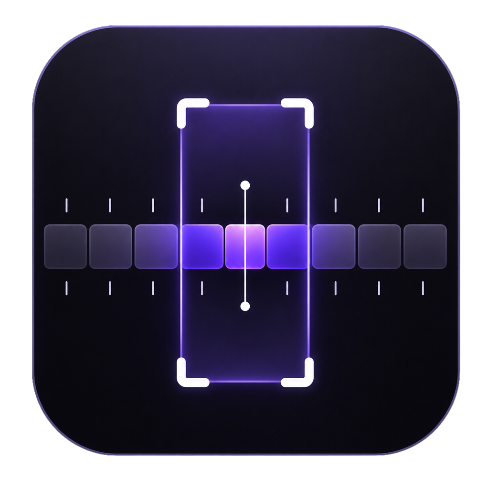
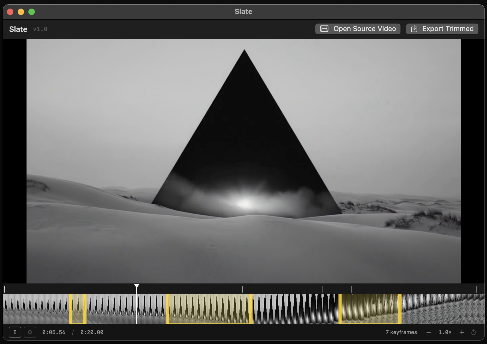

<p align="center">
  
</p>

<h1 align="center">Slate</h1>

<p align="center">
  Multi-segment lossless trim editor for mp4 on macOS.<br>
  Open a video, mark multiple keep-segments on the timeline, export without re-encoding.
</p>

<p align="center">
  <em>Free and open source &middot; MIT license &middot; no third-party dependencies</em>
</p>

---

<p align="center">
  
</p>

Ad-hoc signed, not notarized — distributed via GitHub Releases, see below.

## Download

Prebuilt macOS binary (Apple Silicon, macOS 14+):

→ **[Download the latest release](https://github.com/novolg/Slate/releases/latest)**

1. Grab `Slate-v1.0-macos.zip` from the release page.
2. Double-click to unzip — you'll get `Slate.app`.
3. Move `Slate.app` into `/Applications` (optional but recommended).
4. **First launch:** the app is ad-hoc signed (no Apple Developer ID), so Gatekeeper will refuse to open it normally. Right-click `Slate.app` → **Open** → confirm in the dialog. macOS remembers the choice; subsequent launches work like any normal app.

Prefer to build from source? Read on.

## Requirements

- **macOS 14 (Sonoma) or newer** — uses `@Observable`, modern SwiftUI APIs.
- **Apple Command Line Tools** — ships Swift 5.9+, `sips`, `iconutil`, `codesign`. Full Xcode is **not** required.
- No third-party dependencies — the project links only against Apple frameworks (SwiftUI, AVFoundation, AVKit, AppKit, CoreMedia, VideoToolbox).

## Install dependencies

### 1. Install Apple Command Line Tools

If you don't already have them:

```sh
xcode-select --install
```

A dialog will appear; accept and let it finish (a few minutes).

Verify:

```sh
swift --version          # Apple Swift 5.9 or newer
xcode-select -p          # /Library/Developer/CommandLineTools
sips --version           # part of macOS, sanity-check it resolves
iconutil --help          # ditto
```

### 2. Clone

```sh
git clone https://github.com/novolg/Slate.git
cd Slate
```

That's it — no `npm install`, no `brew install`, no SwiftPM resolve step (no external packages).

## Build & run

### Full app bundle (recommended)

```sh
scripts/build-app.sh             # release build → build/Slate.app
scripts/build-app.sh debug       # debug build (faster compile, larger binary)
open build/Slate.app
```

The script compiles the SPM target, assembles `build/Slate.app/`, generates `build/Slate.icns` from `assets/icon-source.png` if it's newer than the existing `.icns`, and ad-hoc code-signs the bundle.

### Quick dev loop (no `.app` wrapper)

```sh
swift run                        # launches the executable directly
```

Faster iteration but no Dock icon and the window may activate as a background agent on first launch.

## Custom app icon

1. Replace `assets/icon-source.png` with a 1024×1024 PNG.
2. Run `scripts/build-app.sh` — the script detects the source is newer than `build/Slate.icns` and regenerates all macOS icon sizes via `sips` + `iconutil`, copies the result into the bundle, and re-signs.

To force-regenerate the icon without rebuilding the app:

```sh
scripts/build-icon.sh            # output: build/Slate.icns
```

## Hotkeys

| Key                    | Action                                  |
|------------------------|-----------------------------------------|
| `Space`                | play / pause                            |
| `J` / `K` / `L`        | reverse / pause / forward (rate ladder) |
| `←` / `→`              | step one frame                          |
| `I`                    | mark in-point at playhead               |
| `O`                    | mark out-point, commit segment          |
| `Delete` / `Backspace` | remove selected segment                 |
| `Esc`                  | clear in-point / segment selection      |
| `Cmd+Z` / `Shift+Cmd+Z`| undo / redo                             |
| `Cmd+O`                | open mp4                                |
| `Cmd+E`                | export                                  |
| `+` / `=`              | zoom timeline in                        |
| `-`                    | zoom timeline out                       |
| `0`                    | reset zoom                              |
| pinch (trackpad)       | zoom timeline                           |

Hold **Option** while dragging a segment edge to bypass keyframe-aware snapping.

## How lossless trimming works

Stream-copy is only valid at keyframes. Slate:

1. Scans sync samples on load via `AVAssetReader` and builds a keyframe index.
2. Lets you place segment boundaries freely on the timeline (no edit-time snap, per design choice).
3. On export, builds an `AVMutableComposition` of keep-segments and exports with `AVAssetExportPresetPassthrough` (`outputFileType: .mp4`).

The middle of each segment is **stream-copied** (no quality loss). AVFoundation handles partial GOPs at segment boundaries — typically by re-encoding a small sliver on either side of each cut. Net effect: lossless interior, near-lossless edges. For frame-accurate cuts use a re-encoding tool; this app trades that for speed and quality.

## Project layout

```
Slate/
├── Package.swift                  SPM manifest, single executable target
├── Sources/Slate/
│   ├── SlateApp.swift             @main entry, NSApplication activation
│   ├── Models/                    Segment, KeyframeIndex
│   ├── ViewModels/                EditorViewModel (@Observable)
│   ├── Views/                     EditorView, PlayerView, TimelineView, …
│   └── Services/                  KeyframeScanner, ThumbnailGenerator, Exporter
├── scripts/
│   ├── Info.plist                 bundle metadata, mp4 document association
│   ├── build-app.sh               SPM build + .app wrapper + ad-hoc sign
│   └── build-icon.sh              source PNG → .icns pipeline
├── assets/
│   └── icon-source.png            1024×1024 source for the app icon
└── docs/notes.md                  engineering notes (keyframe model, AVFoundation gotchas)
```

## Status

v1.0. Core editor and lossless export work end-to-end.

## License

[MIT](LICENSE). Free and open source — use, modify, and redistribute freely, keep the copyright notice.
