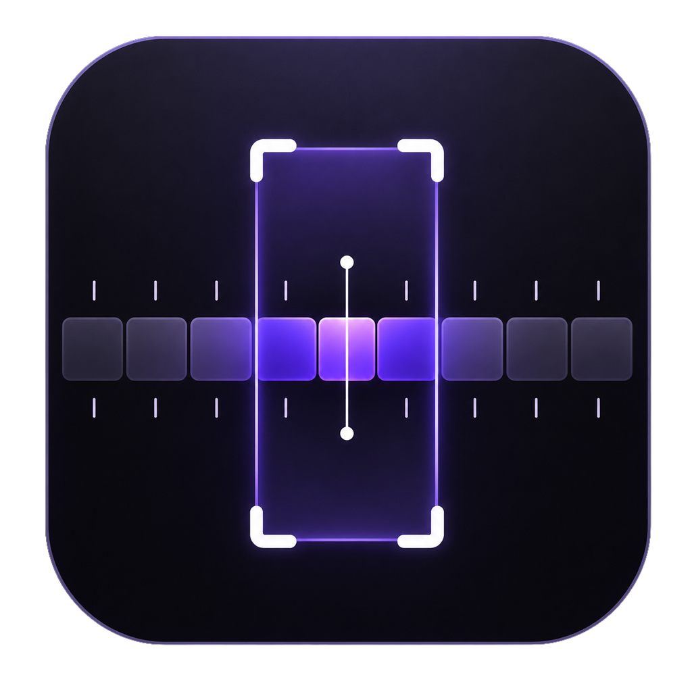
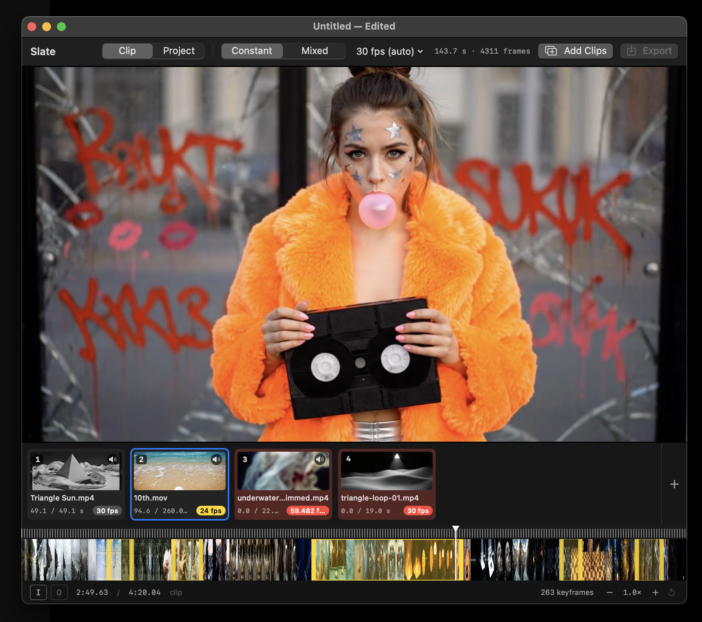

<p align="center">
  
</p>

<h1 align="center">Slate</h1>

<p align="center">
  Multi-clip trim and join editor for macOS.<br>
  Add clips, mark keep-segments in each one, put them in order, export one video at one exact frame rate.
</p>

<p align="center">
  <em>Free and open source &middot; MIT license &middot; no third-party dependencies</em>
</p>

---

<p align="center">
  
</p>

Ad-hoc signed, not notarized — distributed via GitHub Releases, see below.

## Download

Prebuilt macOS binary (Apple Silicon, macOS 14+):

→ **[Download the latest release](https://github.com/novolg/Slate/releases/latest)**

1. Grab `Slate-v2.0-macos.zip` from the release page.
2. Double-click to unzip — you'll get `Slate.app`.
3. Move `Slate.app` into `/Applications` (optional but recommended).
4. **First launch:** the app is ad-hoc signed (no Apple Developer ID), so Gatekeeper will refuse to open it normally. Right-click `Slate.app` → **Open** → confirm in the dialog. macOS remembers the choice; subsequent launches work like any normal app.

Prefer to build from source? Read on.

## Requirements

- **macOS 14 (Sonoma) or newer** — uses `@Observable`, modern SwiftUI APIs.
- **Apple Command Line Tools** — ships Swift 5.9+, `sips`, `iconutil`, `codesign`. Full Xcode is **not** required.
- No third-party dependencies — the project links only against Apple frameworks (SwiftUI, AVFoundation, AVKit, AppKit, CoreMedia, VideoToolbox).

## Install dependencies

### 1. Install Apple Command Line Tools

If you don't already have them:

```sh
xcode-select --install
```

A dialog will appear; accept and let it finish (a few minutes).

Verify:

```sh
swift --version          # Apple Swift 5.9 or newer
xcode-select -p          # /Library/Developer/CommandLineTools
sips --version           # part of macOS, sanity-check it resolves
iconutil --help          # ditto
```

### 2. Clone

```sh
git clone https://github.com/novolg/Slate.git
cd Slate
```

That's it — no `npm install`, no `brew install`, no SwiftPM resolve step (no external packages).

## Build & run

### Full app bundle (recommended)

```sh
scripts/build-app.sh             # release build → build/Slate.app
scripts/build-app.sh debug       # debug build (faster compile, larger binary)
open build/Slate.app
```

The script compiles the SPM target, assembles `build/Slate.app/`, generates `build/Slate.icns` from `assets/icon-source.png` if it's newer than the existing `.icns`, and ad-hoc code-signs the bundle.

### Quick dev loop (no `.app` wrapper)

```sh
swift run                        # launches the executable directly
```

Faster iteration but no Dock icon and the window may activate as a background agent on first launch.

## Custom app icon

1. Replace `assets/icon-source.png` with a 1024×1024 PNG.
2. Run `scripts/build-app.sh` — the script detects the source is newer than `build/Slate.icns` and regenerates all macOS icon sizes via `sips` + `iconutil`, copies the result into the bundle, and re-signs.

To force-regenerate the icon without rebuilding the app:

```sh
scripts/build-icon.sh            # output: build/Slate.icns
```

## How to use

1. **Add clips:** click **Add Clips**, press `Cmd+O`, or drag mp4 / m4v / mov files onto the window. Each clip becomes a card in the clip strip.
2. **Trim:** select a card. A new clip is kept whole. Press `I` and `O` to mark the parts you want to keep. You can drag segment edges on the timeline.
3. **Order:** drag cards to reorder them. Right-click a card to duplicate, remove, show in Finder or locate a missing file.
4. **Preview:** press `Tab` or click **Project** to play all clips in order.
5. **Pick the frame rate:** **Constant** (default) or **Mixed**. See below.
6. **Export:** press `Cmd+E`. The sheet shows what happens to each clip before Slate writes anything.
7. **Save:** `Cmd+S` writes a `.slate` project file. Saved projects autosave. An untitled project is offered back after a crash.

## Hotkeys

| Key                    | Action                                  |
|------------------------|-----------------------------------------|
| `Space`                | play / pause                            |
| `J` / `K` / `L`        | reverse / pause / forward (rate ladder) |
| `←` / `→`              | step one frame                          |
| `I`                    | mark in-point at playhead               |
| `O`                    | mark out-point, commit segment          |
| `Delete` / `Backspace` | remove selected segment                 |
| `Esc`                  | clear in-point / segment selection      |
| `Tab`                  | toggle Clip / Project player            |
| `[` / `]`              | previous / next clip                    |
| `Cmd+N`                | new project                             |
| `Cmd+O`                | open clips or a `.slate` project        |
| `Cmd+S` / `Shift+Cmd+S`| save / save as                          |
| `Cmd+D`                | duplicate selected clip                 |
| `Cmd+Delete`           | remove selected clip                    |
| `Cmd+Z` / `Shift+Cmd+Z`| undo / redo (whole project)             |
| `Cmd+E`                | export                                  |
| `+` / `=`              | zoom timeline in                        |
| `-`                    | zoom timeline out                       |
| `0`                    | reset zoom                              |
| pinch (trackpad)       | zoom timeline                           |

## How export works

Slate has two frame-rate modes.

**Constant (default).** Every clip is re-encoded to one frame rate. The fps menu picks it; **auto** follows the highest frame rate in the project. The output has an exact, constant cadence, so it plays correctly everywhere: upload sites, any player, any editor. Re-encodes use the source codec family (H.264 or HEVC) at the highest bitrate among your clips. Audio is AAC.

**Mixed.** Clips are copied without re-encoding (`AVAssetExportPresetPassthrough`). Each clip keeps its own frame rate. This is fast and lossless, but only Apple players (QuickTime, Safari, Final Cut) play the joins between different frame rates correctly. Use Constant for upload.

All timing math uses exact rational numbers on the real frame timestamps, so there is no floating-point drift. After each export, Slate checks every frame time and the audio sync. If the check fails, Slate writes no file and names the clip that caused it. Slate also refuses unsafe projects before it starts, for example an unsupported codec or clips with and without audio in one project.

Engineering details: `docs/notes.md` and `docs/superpowers/specs/2026-09-29-multi-clip-concat-design.md`.

## Tests

```sh
swift run SlateChecks --strict   # 160 checks, no Xcode needed
scripts/make-test-clips.sh       # optional: media fixtures (needs Homebrew ffmpeg)
```

## Project layout

```
Slate/
├── Package.swift                  SPM manifest: SlateCore library, Slate app, SlateChecks
├── Sources/SlateCore/             multi-clip logic, no UI: planner, timing math,
│                                  re-encoder, validator, .slate file, autosave, undo
├── Sources/SlateChecks/           test harness (replaces XCTest)
├── Sources/Slate/
│   ├── SlateApp.swift             @main entry, menus
│   ├── ViewModels/                ProjectViewModel (@Observable)
│   ├── Views/                     EditorView, TimelineView, ClipStripView, ProjectExportSheet, …
│   └── Services/                  KeyframeScanner, ThumbnailGenerator
├── scripts/
│   ├── Info.plist                 bundle metadata, document types
│   ├── build-app.sh               SPM build + .app wrapper + ad-hoc sign
│   ├── build-icon.sh              source PNG → .icns pipeline
│   └── make-test-clips.sh         dev-only test fixtures
├── assets/
│   └── icon-source.png            1024×1024 source for the app icon
└── docs/notes.md                  engineering notes (keyframe model, AVFoundation gotchas)
```

## Status

v2.0. Multi-clip projects, Constant / Mixed export, `.slate` project files, autosave. Release notes: [`docs/release-notes-v2.0.md`](docs/release-notes-v2.0.md).

## License

[MIT](LICENSE). Free and open source — use, modify, and redistribute freely, keep the copyright notice.
